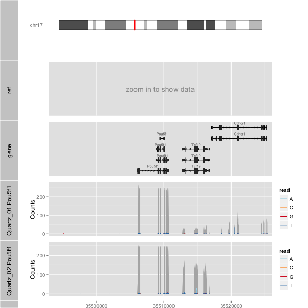
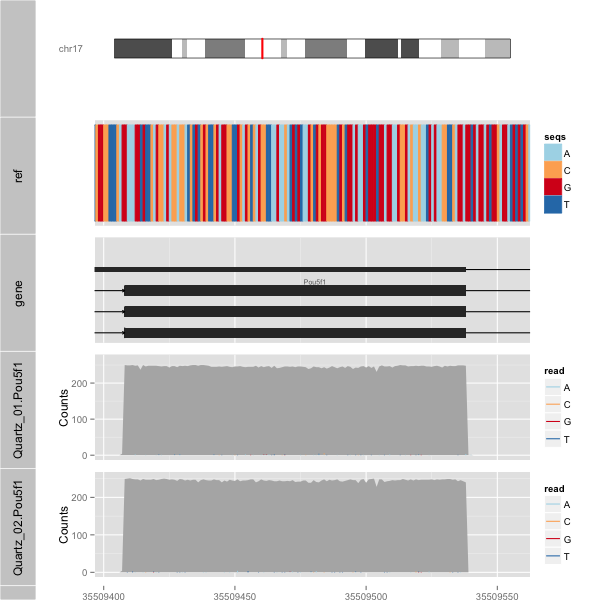
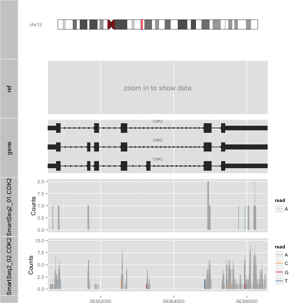

orenogb2
====

Ore no Genome Browser 2

## Description
- wrapper of ggbio
- just type simple command on your terminal
- beautiful visualization by ggbio and ggplot2
- semantic zoom
- eaily loading of transcriptome annotation
- search by gene Symbol
- choose species

## Demo

    q01.bam <- system.file("extdata", "Quartz_01.Pou5f1.bam", package = "orenogb2")
    q02.bam <- system.file("extdata", "Quartz_02.Pou5f1.bam", package = "orenogb2")

    genome.ver <- 'mm10'
    zoom.power <- 1
    quartz.bam.files <- c(q01.bam, q02.bam)
    
    gb.quartz <- orenogb2$new(
      genome.ver = genome.ver,
      zoom.power = zoom.power,
      bam.files  = quartz.bam.files
    )
    
    # Coordination
    gb.quartz$chr      <- "chr17"
    gb.quartz$start.bp <- 35492880
    gb.quartz$end.bp   <- 35526079
    gb.quartz$plotgb()

### Semantic Zoom

    genome.ver <- 'mm10'
    zoom.power <- 1/200
    quartz.bam.files <- c(q01.bam, q02.bam)
    
    gb.quartz <- orenogb2$new(
      genome.ver = genome.ver,
      zoom.power = zoom.power,
      bam.files  = quartz.bam.files
    )
    
    # Coordination
    gb.quartz$chr      <- "chr17"
    gb.quartz$start.bp <- 35492880
    gb.quartz$end.bp   <- 35526079
    gb.quartz$plotgb()

### Search by Gene Symbol

    s01.bam <- system.file("extdata", "Smart-Seq2_01.CDK2.bam", package = "orenogb2")
    s02.bam <- system.file("extdata", "Smart-Seq2_02.CDK2.bam", package = "orenogb2")  

    genome.ver <- 'hg19'
    zoom.power <- 1
    smart2.bam.files <- c(s01.bam, s02.bam)
    
    gb.smart2 <- orenogb2$new(
      genome.ver = genome.ver,
      zoom.power = zoom.power,
      bam.files  = smart2.bam.files
    )
    gb.smart2$getPositionBySymbol('CDK2')
    gb.smart2$plotgb()

## Usage

    R> library(orenogb2)

## Requirement
- R
- Bioconductor Software Packages
    - ggbio
    - GenomicRanges
    - GenomicAlignments
- Bioconductor Annotation Packages
    - Mus.musculus, Homo.sapiens, ...
    - BSgenome.Mmusculus.UCSC.mm10, BSgenome.Hsapiens.UCSC.hg19, ...

## Install

    $ sudo R
    R> source("http://bioconductor.org/biocLite.R")
    R> biocLite(c("ggbio", "GenomicRanges", "GenomicAlignments", "devtools")
    R> biocLite(c("Mus.musculus", "BSgenome.Mmusculus.UCSC.mm10"))
    R> biocLite(c("Homo.sapiens", "BSgenome.Hsapiens.UCSC.hg19"))

    R> library(devtools)
    R> install_github("dritoshi/orenogb2")

## ToDo
- wapper by shell script

## Contribution

## Licence

[MIT](https://github.com/dritoshi/orenogb/blob/master/LICENCE)

## Author

[dritoshi](https://github.com/dritoshi)
